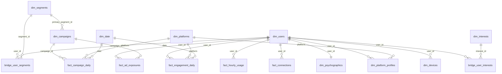

# CampusPulse Media — Synthetic Social Media Audience Dataset

A **100% fake, fully synthetic** dataset for building a Power BI teaching dashboard
about the data social media platforms collect on users — and how that data gets
packaged and sold to advertisers.

**The story:** *CampusPulse Media* is a fictional social media marketing company.
It maintains a research **panel of 2,000 college students** across 15 U.S.
universities, tracks their behavior on **Instagram, TikTok, Snapchat, X (Twitter),
and Facebook** over the summer of 2026 (June 1 – August 31), packages them into
**12 sellable audience segments**, and runs **12 ad campaigns** for fictional
advertiser brands against those segments.

> ### ⚠️ Everything here is synthetic
> Every person, name, email, phone number, handle, device ID, friendship, and
> metric was generated by `generate_data.py` (seed 42). No real individuals are
> described; any resemblance to a real person is coincidental. Emails use the
> reserved `example.edu` domain and phone numbers use the fictional `555-01xx`
> range. Real universities appear only as fictional settings, and all advertiser
> brands are invented. The *shape* of the data mirrors what real ad platforms and
> data brokers work with — that's the lesson — but none of it is real.

---

## Files at a glance (~695,000 rows, ~40 MB)

| File | Rows | One row is… |
|---|---:|---|
| `data/dim_users.csv` | 2,000 | a student in the panel: identity, demographics, campus + hometown geo |
| `data/dim_psychographics.csv` | 2,000 | a student's **inferred** traits: Big Five, chronotype, values, political lean, purchase intent |
| `data/dim_platforms.csv` | 5 | a platform: parent company, HQ, launch year, real privacy-policy URL |
| `data/dim_platform_profiles.csv` | 6,538 | one account (user × platform): followers, posting habits, **privacy settings** |
| `data/dim_devices.csv` | 4,071 | a device: model, OS, **mobile advertising ID**, ad-tracking opt-in, pickups/day |
| `data/dim_interests.csv` | 50 | an ad-targeting interest category |
| `data/bridge_user_interests.csv` | 27,993 | user ↔ interest with affinity score and *how it was learned* (declared / inferred / lookalike) |
| `data/dim_segments.csv` | 12 | a packaged audience CampusPulse sells: pitch, rule, member count, suggested CPM |
| `data/bridge_user_segments.csv` | 4,443 | user ↔ segment with match strength |
| `data/dim_campaigns.csv` | 12 | an advertiser campaign: flight, budget, spend, objective, target segment |
| `data/fact_engagement_daily.csv` | 504,077 | one user × platform × day: minutes, sessions, **video completion %, videos forwarded**, likes, ads seen/clicked, late-night minutes |
| `data/fact_hourly_usage.csv` | 96,000 | user × hour-of-day × weekday/weekend: typical minutes online (heatmap fuel) |
| `data/fact_ad_exposures.csv` | 2,840 | what one **panel member** saw of one campaign: impressions, clicks, conversions |
| `data/fact_campaign_daily.csv` | 992 | full campaign delivery per day per platform: impressions, clicks, spend, revenue |
| `data/fact_connections.csv` | 43,520 | a friendship edge (each pair appears in both directions) with interaction strength |
| `data/dim_date.csv` | 92 | calendar day, incl. `academic_period` (fall semester starts Aug 24) |
| `data/data_dictionary.csv` | 165 | **every column**, tagged by `collection_method` and `sensitivity` — load it as a table and visualize it |

The two campaign facts reconcile by design: `fact_campaign_daily` equals the panel
totals in `fact_ad_exposures` × the campaign's `panel_scale_factor` (each panel
member stands in for 250–600 students of the full audience — the same way TV and
web audience measurement extrapolates from a panel). One deliberate
non-reconciliation: `ads_seen` in `fact_engagement_daily` counts ads from *all*
advertisers, so it is much larger than CampusPulse's own campaign impressions.

---

## Data model (star schema)



## Prefer the ready-built Power BI file

A complete Power BI project is already in **`powerbi/CampusPulse.pbip`** — the
model, relationships, 109 DAX measures, a custom theme, and a six-page report
with 112 visuals (Smart Narrative, Key Influencers and a Decomposition Tree
included). Open it in Power BI Desktop, point the `DataFolder` parameter at
`data/`, and refresh. See **[POWERBI.md](POWERBI.md)** for the walkthrough,
including how it was validated and two deliberate modelling decisions that make
good classroom discussion.

The manual instructions below are still worth following if you want students to
build the model themselves.

## Power BI quickstart (building it by hand)

1. **Get Data → Text/CSV** and load every file in `data/` (or **Get Data →
   Folder** pointed at `data/` and reference each file). Check that
   `TRUE`/`FALSE` columns typed as Boolean and dates as Date.
2. In **Model view**, create the relationships in the diagram above
   (single-direction, one-to-many from the `dim`/`bridge` tables into the facts;
   `dim_users 1—1 dim_psychographics`). Power BI will auto-detect most of them.
3. Mark `dim_date` as the **date table** (`date` column). Join it to
   `fact_engagement_daily[activity_date]` and `fact_campaign_daily[activity_date]`.
4. For segment/interest analysis, filter flows `dim_segments → bridge_user_segments
   → dim_users → facts`; set the bridge relationships so filters reach `dim_users`
   (enable "both" cross-filter direction on the two bridge tables, or use
   `CROSSFILTER` in measures).
5. Sort `month_name` by `month_num` and `day_name` by `day_of_week_num`.

### Starter DAX measures

```dax
Total Minutes        = SUM ( fact_engagement_daily[active_minutes] )
Daily Active Users   = DISTINCTCOUNT ( fact_engagement_daily[user_id] )
Avg Minutes per DAU  = DIVIDE ( [Total Minutes], [Daily Active Users] )
Avg Session Length   = DIVIDE ( [Total Minutes], SUM ( fact_engagement_daily[sessions] ) )

-- video metrics (completion weighted by videos actually viewed)
Videos Viewed        = SUM ( fact_engagement_daily[videos_viewed] )
Video Completion %   = DIVIDE (
    SUMX ( fact_engagement_daily,
        fact_engagement_daily[videos_viewed] * fact_engagement_daily[avg_video_completion_pct] ),
    [Videos Viewed] )
Forward Rate per 1K Videos = DIVIDE ( SUM ( fact_engagement_daily[videos_forwarded] ), [Videos Viewed] ) * 1000

Late-Night Share %   = DIVIDE ( SUM ( fact_engagement_daily[late_night_minutes] ), [Total Minutes] )

-- campaign metrics
Total Impressions    = SUM ( fact_campaign_daily[impressions] )
Total Clicks         = SUM ( fact_campaign_daily[clicks] )
Spend                = SUM ( fact_campaign_daily[spend_usd] )
Revenue              = SUM ( fact_campaign_daily[revenue_usd] )
CTR %                = DIVIDE ( [Total Clicks], [Total Impressions] )
CPM                  = DIVIDE ( [Spend] * 1000, [Total Impressions] )
CPC                  = DIVIDE ( [Spend], [Total Clicks] )
ROAS                 = DIVIDE ( [Revenue], [Spend] )
Panel Reach          = DISTINCTCOUNT ( fact_ad_exposures[user_id] )
Avg Frequency        = DIVIDE ( SUM ( fact_ad_exposures[impressions] ), [Panel Reach] )

-- privacy lens
% Ads Personalization On = AVERAGEX ( dim_platform_profiles,
    IF ( dim_platform_profiles[ad_personalization_enabled], 1.0, 0.0 ) )
% Location Shared        = AVERAGEX ( dim_platform_profiles,
    IF ( dim_platform_profiles[location_sharing_enabled], 1.0, 0.0 ) )
% Contacts Uploaded      = AVERAGEX ( dim_platform_profiles,
    IF ( dim_platform_profiles[contacts_synced], 1.0, 0.0 ) )
```

### Dashboard page ideas

1. **Audience 360** — map of campus + hometown locations, platform adoption,
   demographics, spend-power distribution; slice everything by university, major,
   class year, segment.
2. **Screen Time & Behavior** — daily minutes trend (watch the Aug 24 semester
   shift), hour-of-day × weekday/weekend heatmap from `fact_hourly_usage`, video
   completion % and forward rate by platform, late-night share by chronotype.
3. **Segment Marketplace** — the "product catalog": card per segment with member
   count, match strength, suggested CPM, top over-indexing platform, top interests;
   this is the page that sells the audience.
4. **Campaign Performance** — the advertiser view: spend pacing vs. flight dates,
   CTR/CPM/ROAS by campaign and platform, reach & frequency from the panel,
   funnel from impressions → clicks → conversions. Note the two Awareness
   campaigns' terrible ROAS — the discussion writes itself.
5. **Network & Influence** — friendship edges by university (homophily is baked
   in: ~75% of connections are same-campus), micro-influencer identification via
   follower counts + social influence score.
6. **The Privacy Lens** — built from `data_dictionary.csv`: count of collected
   fields by `collection_method` (declared vs. observed vs. inferred) and
   `sensitivity`; opt-in rates for ad personalization, location, contact upload,
   iOS App Tracking Transparency vs. Android defaults in `dim_devices`.

### Discussion prompts for students

- Only **13 of the 165 columns** are *declared* by the user. 41 are *observed*,
  36 are *inferred by a model*, and 37 are tagged high-sensitivity. Where did
  everything the user never typed come from?
- `dim_psychographics` contains an *inferred political leaning* with a confidence
  score. The platform never asked. How would a model infer this — and should it?
- Two of the five platforms share one parent company (`dim_platforms`). What does
  that mean for combining data across apps?
- Your phone's `mobile_advertising_id` appears in `dim_devices`. Trace how it lets
  an advertiser connect your Instagram scrolling to a purchase in another app.
- `fact_connections` means the platform knows things about you *from your friends*
  even if your own settings are locked down. Find a locked-down user with
  talkative friends.
- Compare `hashed_email` to `email`. Why do ad systems trade hashes, and does
  hashing actually make it anonymous?

---

## Regenerating / resizing

```bash
python3 generate_data.py        # stdlib only, ~6s, deterministic (seed 42)
```

Tweak the constants at the top (`N_USERS`, date window, `SEED`) to resize.
The script re-derives every file, keeps referential integrity, and asserts that
campaign daily rows still reconcile with panel exposures × scale factor.

Approximate geo coordinates are intentional (city-level, for map visuals).
Platform facts in `dim_platforms` (parent companies, privacy-policy links) are
real and current as of 2026 for classroom reference; every behavioral number in
this dataset is invented.
